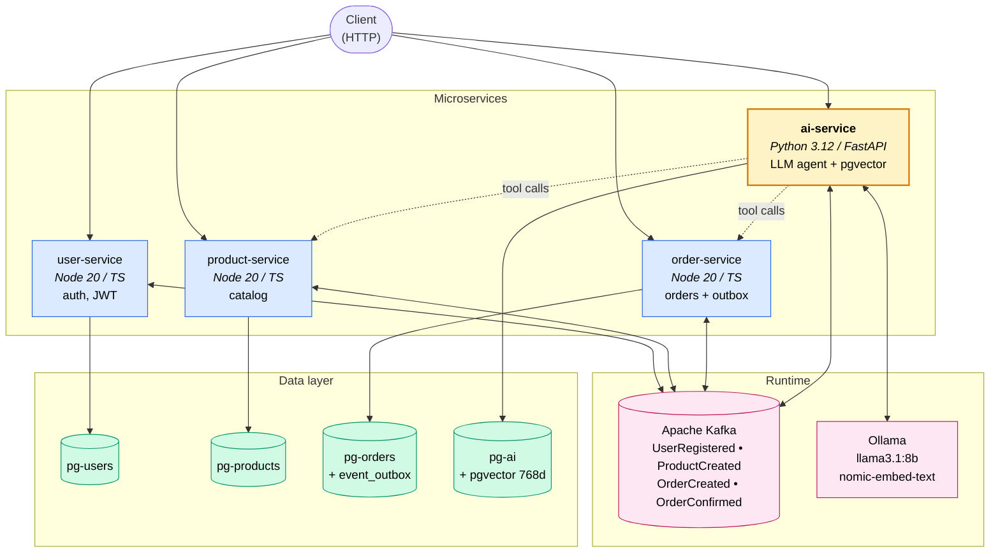

# agentic-commerce

> **A self-hosted LLM agent placing real orders through 4 microservices.** Natural language in, executed transactions out — with pgvector semantic search, transactional outbox guarantees, and full correlation-ID tracing.

## What this is

An e-commerce platform where **the AI service is a first-class citizen**, not a chatbot bolted on the side. A locally-hosted Llama 3.1 8B model orchestrates the catalog, ordering, and embedding services through tool-calling — placing real transactions backed by a transactional outbox, Kafka events, and a 768-dimension pgvector index.

Built to demonstrate that "agentic AI" is mostly *backend infrastructure problems* (state, retries, idempotency, observability, safety gates) wearing an LLM hat.

## A real interaction

User types `"Find me a quiet keyboard"` and the agent:

1. Picks `semantic_search_products` from its tool list
2. Embeds the query via Ollama (`nomic-embed-text`, 768-dim)
3. pgvector returns the top matches by cosine similarity
4. ai-service enriches results with live prices from `product-service` over HTTP
5. The LLM recommends the **Mechanical Keyboard** at the real catalog price
6. On "propose an order," `propose_order` writes to a `pending_orders` row and returns a summary
7. On "confirm," `confirm_order` calls `order-service`, which writes a real row to `pg-orders` inside the transactional outbox

Three turns of natural language. End to end, ~25 seconds with the LLM warm. Every step traces through structured logs with a single correlation ID.

## Why this stands out

- **Real agency, not a demo.** The LLM places a real order. End to end.
- **Two-phase safety gate.** The agent cannot create an order in one turn. The schema enforces propose-then-confirm — preventing runaway agent behavior at the architectural level, not via prompt-engineering wishes.
- **Self-hosted LLM.** No API keys, no per-token costs. Ollama running Llama 3.1 8B + `nomic-embed-text` (768d) inside Docker. The whole stack runs on a 16GB MacBook.
- **Polyglot microservices.** TypeScript (strict mode) for user/product/order — Python (FastAPI + asyncpg) for the AI service. Each language at the boundary where it's strongest.
- **Production patterns under it.** Transactional outbox, correlation IDs across HTTP + Kafka, structured logging with redaction, healthchecks gating service start, multi-stage Docker builds, non-root containers.

## Architecture



| Layer | Tech | Purpose |
|---|---|---|
| Gateway-less microservices | Node 20 + TypeScript, Python 3.12 + FastAPI | One service per business domain |
| Event bus | Apache Kafka | OrderCreated, ProductCreated, UserRegistered |
| Per-service databases | Postgres 16 (`pgvector` for AI) | Database-per-service isolation |
| LLM serving | Ollama (Llama 3.1 8B) | Tool-calling chat completion |
| Embeddings | Ollama (`nomic-embed-text`, 768d) | Cosine-similarity product search |
| Shared TS lib | `@agentic-commerce/common` | Pino logging, AsyncLocalStorage correlation, typed errors, env validation |
| Runtime | Docker Compose | Healthcheck-gated startup ordering |

## Key engineering patterns

**Transactional outbox** in `order-service` — order rows and `event_outbox` rows commit in the same Postgres transaction, then a polling worker ships events to Kafka. Guarantees at-least-once event publishing even if the process crashes between DB commit and Kafka send.

**Correlation IDs everywhere** — generated at the request edge, propagated through HTTP headers, Kafka message headers, and the Python `ContextVar` / Node `AsyncLocalStorage`. Every log line includes `correlation_id` so a single grep traces a request from chat → tool call → DB write → outbox → Kafka.

**LLM arg-coercion layer** — small models pass numeric args as strings, lists as JSON-strings, and items as bare integers. The tool executor normalizes all of these before calling business logic. Real production agents need this layer; tutorials skip it.

**Two-phase order placement** — `propose_order` writes to `pending_orders` and returns awaiting-confirmation. `confirm_order` reads the proposal and only then calls `order-service`. The LLM is structurally prevented from one-shot order creation; the prompt rules are belt-and-suspenders.

**Database-per-service** — `pg-users`, `pg-products`, `pg-orders`, `pg-ai`. Each service owns its own schema. Cross-service reads happen over HTTP with correlation IDs, never via direct DB access.

## Quick start

Requires Docker Desktop with at least 12GB memory allocated (the LLM needs ~5GB resident).

```bash
# 1. Build everything
docker compose build

# 2. Bring up infra first
docker compose up -d zookeeper pg-users pg-products pg-orders pg-ai
docker compose up -d kafka ollama

# 3. Wait ~30s for kafka and ollama to be healthy
docker compose ps   # look for "(healthy)"

# 4. Pull the LLM and embedding models (~7GB, one-time)
docker compose exec ollama ollama pull llama3.1:8b
docker compose exec ollama ollama pull nomic-embed-text

# 5. Start the services
docker compose up -d user-service product-service order-service ai-service

# 6. Verify the full stack
./scripts/smoke-test.sh
./scripts/smoke-test-phase2.sh
```

## Try the agent

```bash
# Search semantically — natural language, returns real catalog data
curl -s -X POST http://localhost:8000/ai/chat \
  -H 'Content-Type: application/json' \
  -d '{"user_id":1,"session_id":"demo","message":"Find me a quiet keyboard"}' \
  | python3 -m json.tool

# Propose an order
curl -s -X POST http://localhost:8000/ai/chat \
  -H 'Content-Type: application/json' \
  -d '{"user_id":1,"session_id":"demo","message":"Propose an order for one of those"}' \
  | python3 -m json.tool

# Confirm — the agent writes a real row to pg-orders
curl -s -X POST http://localhost:8000/ai/chat \
  -H 'Content-Type: application/json' \
  -d '{"user_id":1,"session_id":"demo","message":"Yes, confirm it"}' \
  | python3 -m json.tool

# Verify the real order materialized
docker compose exec pg-orders psql -U postgres -d orders_db \
  -c "SELECT id, user_id, total_amount, status, created_at FROM orders ORDER BY id DESC LIMIT 3;"
```

## Layout

```
.
├── shared/common/                   @agentic-commerce/common (TS shared lib)
│   └── src/{logger,correlation,health,shutdown,env,kafka,errors}
├── services/
│   ├── user-service/                Auth: register/login + JWT
│   ├── product-service/             Catalog CRUD, publishes ProductCreated
│   ├── order-service/               Orders + transactional outbox
│   └── ai-service/                  Python: pgvector + LLM agent
│       ├── app/
│       │   ├── routers/             /healthz, /ai/semantic-search, /ai/chat
│       │   ├── services/
│       │   │   ├── ollama.py        Ollama HTTP client (embed + chat)
│       │   │   ├── embeddings.py    pgvector upsert + cosine search
│       │   │   ├── tools.py         5 tool schemas for LLM
│       │   │   ├── tool_executor.py Tool execution with arg coercion
│       │   │   └── agent.py         Multi-turn loop with persisted memory
│       │   └── events/consumer.py   Kafka consumer for auto-embedding
│       └── migrations/              pgvector + conversations + pending_orders
├── docker-compose.yml               4 services + 4 Postgres + Kafka + Ollama
└── scripts/                         Smoke tests + Ollama setup
```

## Roadmap

| Phase | Feature | Status |
|---|---|---|
| 1 | Foundation: shared lib, 4 services, outbox, semantic search | ✅ |
| 2 | Agentic shopping assistant with LLM tool-calling | ✅ |
| 3 | Event-driven AI enrichment (auto SEO descriptions on ProductCreated) | ⏳ |
| 4 | Saga compensating actions for failed orders | ⏳ |
| 5 | OpenTelemetry → Jaeger distributed traces | ⏳ |
| 6 | Next.js chat frontend | ⏳ |

## Resume framing

> Built a self-hosted agentic AI system in a polyglot microservices platform. A locally-hosted Llama 3.1 8B model orchestrates 3 backend services via tool-calling (semantic search, product lookup, two-phase order placement) with conversation memory persisted in Postgres. Designed a confirmation-gated execution model that structurally prevents the agent from placing orders without explicit user consent — addressing a common safety failure mode of LLM-driven action systems.

> Implemented the transactional outbox pattern in TypeScript using Postgres `FOR UPDATE SKIP LOCKED`, guaranteeing at-least-once event publishing to Kafka across the order lifecycle. End-to-end correlation IDs propagate from natural-language input through pgvector cosine-similarity search to Kafka message headers, enabling full request tracing via structured logs alone.

> Containerized 4 services (TypeScript + Python + Postgres + Kafka + Ollama) with multi-stage Docker builds, non-root execution, and `condition: service_healthy` startup ordering. Designed defensive argument coercion in the LLM tool layer to handle real-world model output quirks (string-encoded numerics, JSON-string-wrapped lists, bare-integer items) — a layer most tool-calling implementations skip and discover the hard way in production.

## License
MIT
